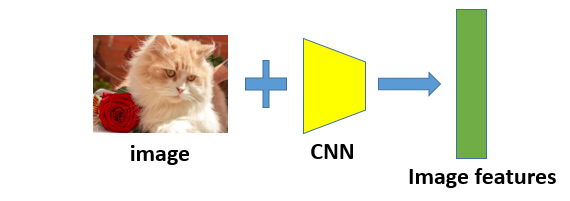
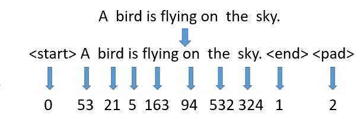

simple-image-caption-with-Pytorch
============================================
This is a reimplementation of the basic image caption structures(CNN-RNN).
`CNN-(ResNet18), RNN-(LSTM), dataset(MSCOCO), Toolkit(Pytorch)`

## Directory
* [Background](#background)
* [Algorithm](#algorithm)
* [Example result](#example-result)
* [Reference](#reference)

****
## **Background**
Image caption is some techniques that help computers to understand the picture given to them and express the picture by nature languages.

****
## **Algorithm**
1. Extract features from the input images with convolutional neural network (in this work is pretrained `Resnet18`)
* Input: batch of images with the shape`(N, C, H, W)`
* Output: batch of features of shape`(N, D)`  
`N:batch size, C:image channel(RGB), H:image height, W:image weight, D:feature dimensions(512)`

just as the figure shows:  
  

2. Encode the sentence into vectors with a dictionary and put `<start>, <end>, <pad>` into sentences. 
* Input: batch of strings with shape`(N, *)`
* Output: batch of vectors with shape`(N, L)`  
`N:batch size, *:length of the sentence, L:fixed length of the vector`

just as the figure shows:  
  

3. Use the long short-term memory(LSTM) model as the RNN to realize the generation part.

****
## **Example result**

****
## **Reference**